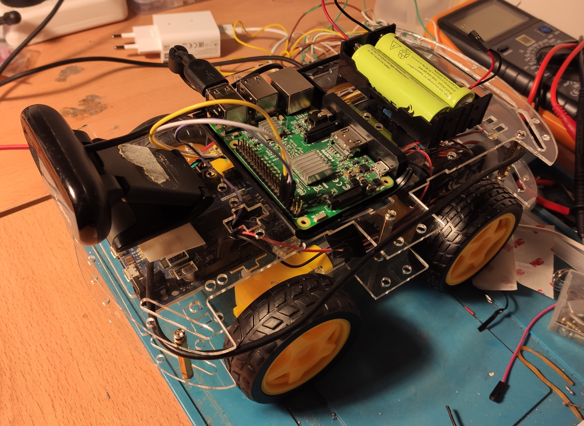

# roverbridge

## Overview

Bridge to integrate [rover-firmware](https://github.com/nhorro/rover-firmware) to ROS.
Received telemetry through custom serial protocol is republished using ROS paradigm and some some commands are exposed as ROS services. This package is related to:

- [roverstation](https://github.com/nhorro/roverstation)
- [rovervision](https://github.com/nhorro/rovervision)

and:

- [rover-firmware](https://github.com/nhorro/rover-firmware)

**Keywords:** rover, ros, raspberrypi, arduino.



### Building from Source

#### Dependencies

- [Robot Operating System (ROS)](http://wiki.ros.org) (middleware for robotics).

#### Building

To build from source, clone the latest version from this repository into your catkin workspace and compile the package using:
```bash
cd catkin_workspace/src
git clone (https://github.com/nhorro/roverbridge)
cd ../
rosdep install --from-paths . --ignore-src
catkin_make
```

## Usage

Typical usage scenario is in Rover (Raspberry Pi) together with a camera node:

```bash
export ROS_IP="RASPBERRY_PI_IP" 
export ROS_MASTER_URI="http://LAPTOP_IP:11311"
roslaunch roverbridge bridgecam.launch 
```

or to run bridge only:

```bash
export ROS_IP="RASPBERRY_PI_IP" 
export ROS_MASTER_URI="http://LAPTOP_IP:11311"
roslaunch roverbridge bridge.launch 
```

## Launch files

* **bridgecam.launch:** Launch bridge and camera(typical usage scenario)

     Argument set

     - **`port`** Serial port.
     - **`baudrate`** Baudrate.
     - **`vehicle_id`** vehicle_id used as prefix in pub/sub messages.

## Nodes

### roverbridge

Acts as a bridge between rover and ROS.

#### Subscribed Topics

* **`/cmd_vel`** ([geometry_msgs/cmd_vel])

	This should be desired Rover linear and angular speeds. However, in the current version as no PID is implemented throttle and angular values are mapped directly to voltage values applied to the motors.

#### Published Topics

* **`odom`** ([nav_msg/imu])

	Odometry.

* **`imu`** ([sensor_msgs/imu])

	Readings from IMU sensor.